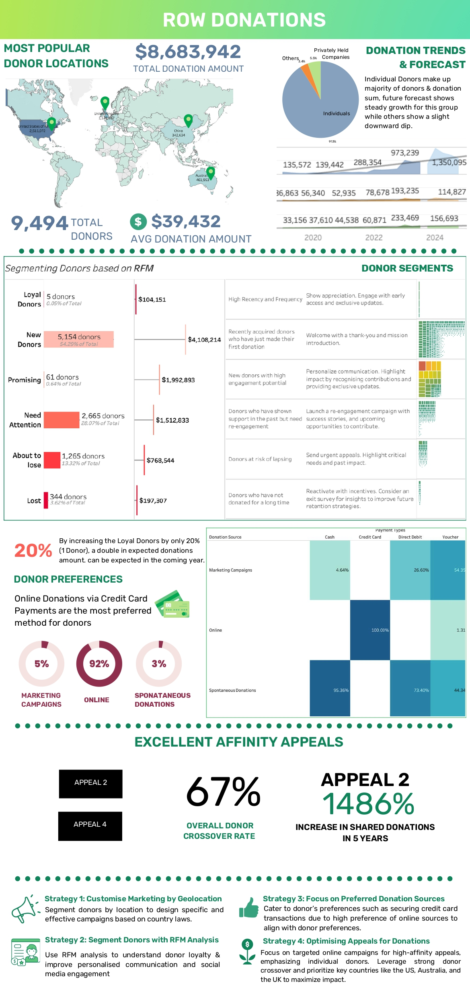
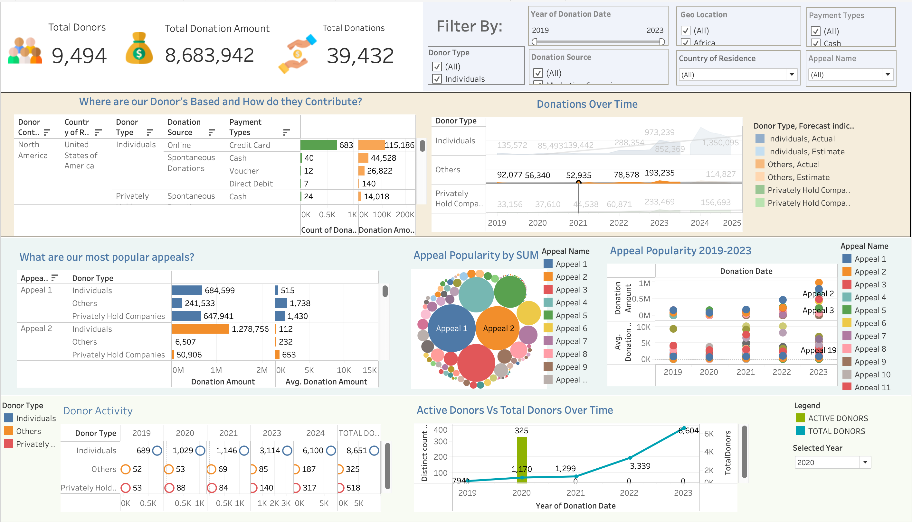

# ReachOut Worldwide Donation Analytics Dashboard

## Project Overview

This project analyses donation behaviour for ReachOut Worldwide (ROW), a global non-profit organisation.

The objective was to identify donation trends, segment donors using RFM analysis, evaluate appeal performance, and provide data-driven fundraising recommendations.

## Business Problem

ROW wanted to understand:

- Which donors contribute the most value
- Which appeals drive the highest engagement
- How donation behaviour changes over time
- Opportunities to improve donor retention and fundraising performance

## Tools Used

- Tableau
- Microsoft Excel
- Data Visualisation
- RFM Analysis
- Forecasting

## Key Analysis

### Donor Segmentation (RFM)

Donors were segmented into:

- Loyal Donors
- New Donors
- Promising Donors
- Need Attention
- About to Lose
- Lost Donors

### Donation Trends

- Analysed donations from 2019–2023
- Identified donation growth patterns
- Forecasted future donor behaviour

### Appeal Analysis

- Appeal 2 generated the strongest engagement
- 67% donor crossover rate
- 1486% increase in shared donations

### Geographic Analysis

Top donor regions:

- United States
- Australia
- United Kingdom

## Key Findings

- Individual donors contributed the majority of donations
- Online donations were the preferred donation channel
- Increasing loyal donors by 20% could significantly increase future donations
- Appeal 2 was the most effective fundraising campaign

## Business Recommendations

1. Improve donor retention programs
2. Focus on high-performing appeals
3. Personalise donor communication using RFM segments
4. Increase investment in online fundraising channels

## Project Outcomes

- Analysed 9,494 donors
- Examined $8.68M donation value
- Developed actionable fundraising strategies
- Created executive dashboards for decision-making

